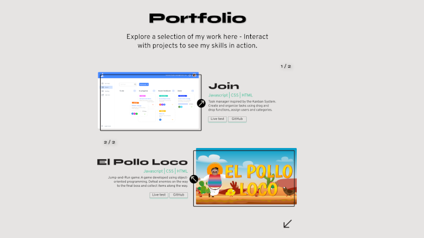

# 🌐 Personal Portfolio – Angular SPA

This is my personal developer portfolio, built as a fully responsive Single Page Application using **Angular**, **TypeScript**, and **SCSS**. The goal is to present my skills, projects, and experience in a clean, user-friendly, and professional way – optimized for recruiters and hiring managers.

---

## 🚀 Live Demo

🔗 [Live Demo – portfolio.dev2k.org](https://portfolio.dev2k.org)

---

## 📸 Preview

---

## 🛠️ Technologies Used

- **Angular** (vXX) – SPA Framework
- **TypeScript** – Strong typing and maintainability
- **SCSS** – Structured styling
- **HTML5 / CSS3** – Semantic and responsive design
- **Angular Router** – Navigation between sections
- **Responsive Design** – Mobile-first approach
- **GitHub Pages / Netlify / Vercel** – Hosting
- **Figma** – Design Prototypes

---

## 📁 Folder Structure

