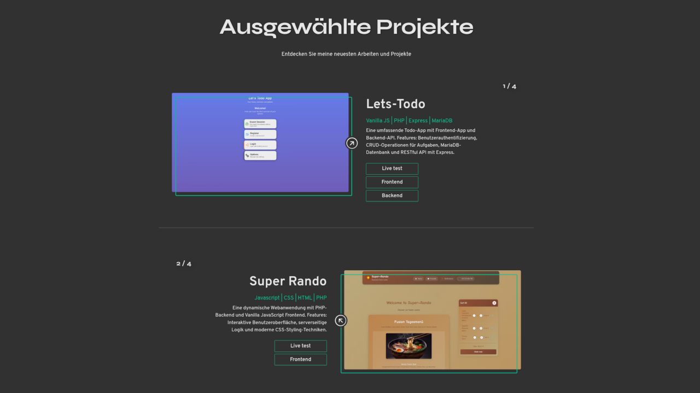

# 💼 Personal Portfolio – Angular SPA

[](https://angular.io/)
[](https://www.typescriptlang.org/)
[](https://sass-lang.com/)
[](https://portfolio.dev2k.org/coverage/index.html)
[](./TESTING-REPORT.md)
[](LICENSE)

A fully responsive, modern portfolio website built as a Single Page Application (SPA) to showcase my skills, projects, and professional experience. Designed with a mobile-first approach and optimized for recruiters and hiring managers.

[🌐 Live Demo](https://portfolio.dev2k.org) | [📊 Coverage Report](https://portfolio.dev2k.org/coverage/index.html) | [📚 API Docs](https://portfolio.dev2k.org/jsdoc/index.html) | [📖 Testing Guide](./TESTING-REPORT.md)

---

## 🚀 Live Demo

🔗 **[portfolio.dev2k.org](https://portfolio.dev2k.org)**

---

## 📸 Preview



---

## ✨ Features

- 🎨 **Light/Dark/Auto Theme** – System preference detection with manual override
- 🌍 **i18n (EN/DE)** – Multi-language support with seamless switching
- 📱 **Fully Responsive** – Optimized for mobile, tablet, and desktop
- ⚡ **PWA with Service Worker** – Offline support and app-like experience
- ♿ **Accessible (ARIA)** – WCAG compliant with keyboard navigation
- 🧪 **96.4% Test Coverage** – 823 passing tests with comprehensive coverage
- 📧 **Contact Form** – Integrated PHP backend with email notifications
- 🔒 **Security Features** – Rate limiting, XSS protection, CORS configuration
- 🎯 **SEO Friendly** – Semantic HTML and optimized meta tags
- 📊 **Project Showcase** – Dynamic project cards with live demos

---

## 🛠️ Tech Stack

**Frontend**

- Angular 21 (Standalone, Signals, Zoneless)
- TypeScript 5.7
- SCSS
- Service Worker (PWA)

**Testing & Quality**

- Jasmine + Karma (823 tests)
- 96.4% Code Coverage
- ESLint & Prettier

**Backend**

- PHP 8+ (Contact API)
- Apache with .htaccess

**DevOps**

- GitHub Actions (CI/CD)
- FTP Deployment to IONOS
- JSDoc (API Documentation)

---

## 📁 Project Structure

```
Portfolio/
├── .github/
│   └── workflows/
│       └── deploy.yml               # CI/CD Pipeline (Tests, Build, Deploy)
├── public/
│   ├── api/
│   │   └── contact/                 # PHP Contact Form API
│   │       ├── contact.php          # Production endpoint (not in Git)
│   │       ├── contact.example.php  # Template file
│   │       └── README.md            # API setup guide
│   ├── fonts/                       # Overpass, Syne
│   ├── i18n/                        # Translation files (de.json, en.json)
│   ├── theme-dark/                  # Dark theme PWA icons
│   ├── theme-light/                 # Light theme PWA icons
│   └── manifest-*.webmanifest       # PWA manifests
├── src/
│   ├── app/
│   │   ├── core/                    # Core services & models
│   │   │   ├── interceptors/        # HTTP interceptors
│   │   │   ├── models/              # TypeScript interfaces
│   │   │   ├── services/            # Business logic (8 services)
│   │   ├── features/                # Feature modules
│   │   │   ├── home/                # Home page sections
│   │   │   │   ├── components/      # Hero, About, Skills, Projects, Contact
│   │   │   │   └── pages/           # HomePage
│   │   │   ├── legal/               # Legal pages
│   │   │   │   └── pages/           # Imprint, Privacy, Sources
│   │   │   ├── projects/            # Project components
│   │   │   │   └── components/      # ProjectCard
│   │   ├── layout/                  # App layout
│   │   │   ├── header/              # Navigation, Theme/Lang switcher
│   │   │   ├── footer/              # Footer, Social links
│   │   ├── shared/                  # Reusable components
│   │   │   ├── components/          # Buttons, UI components
│   │   │   ├── directives/          # IconHover, NoScroll
│   │   │   ├── pages/               # NotFoundPage (404)
│   │   ├── app.ts                   # Root component
│   │   ├── app.config.ts            # App configuration & providers
│   │   ├── app.routes.ts            # Route definitions
│   │   └── app.spec.ts              # Root component tests
│   ├── assets/
│   │   ├── images/                  # Profile, project screenshots
│   │   └── screenshots/             # App previews
│   ├── environments/                # Environment configs
│   ├── styles/                      # Global SCSS
│   │   ├── components/              # Component-specific styles
│   │   ├── _fonts.scss
│   │   ├── _layout.scss
│   │   ├── _mixins.scss
│   │   ├── _typography.scss
│   │   └── _variables.scss
│   ├── index.html                   # HTML entry point
│   ├── main.ts                      # Application bootstrap
│   └── styles.scss                  # Global styles entry
├── angular.json                     # Angular workspace config
├── ngsw-config.json                 # Service Worker config
├── package.json                     # Dependencies & scripts
├── tsconfig.json                    # TypeScript config
├── jsdoc.json                       # JSDoc configuration
├── DEPLOYMENT-GUIDE.md              # Deployment documentation
├── TESTING-REPORT.md                # Test coverage report
├── TEAM-GUIDE.md                    # Developer guide
└── README.md                        # This file
```

---

## 📁 Deployment Structure

After deployment to **portfolio.dev2k.org**, the following structure is created:

```
portfolio.dev2k.org/
├── index.html                       # Portfolio App
├── assets/                          # Images, fonts, i18n
├── *.js, *.css                      # Compiled bundles
├── .htaccess                        # Apache config (routing + security)
├── coverage/                        # 📊 Test Coverage Report
│   └── index.html                   # https://portfolio.dev2k.org/coverage/index.html
└── jsdoc/                           # 📚 API Documentation
    └── index.html                   # https://portfolio.dev2k.org/jsdoc/index.html
```

**Live URLs:**

- 🌐 App: [portfolio.dev2k.org](https://portfolio.dev2k.org)
- 📊 Coverage: [portfolio.dev2k.org/coverage](https://portfolio.dev2k.org/coverage/index.html)
- 📚 API Docs: [portfolio.dev2k.org/jsdoc](https://portfolio.dev2k.org/jsdoc/index.html)

---

## 📖 Documentation

- [TESTING-REPORT.md](./TESTING-REPORT.md) – Complete test coverage report
- [TEAM-GUIDE.md](./TEAM-GUIDE.md) – Developer onboarding guide
- [DEPLOYMENT-GUIDE.md](./DEPLOYMENT-GUIDE.md) – Deployment setup & CI/CD
- [Component Docs](./src/app/) – Component-specific READMEs

---

## 👤 Author

**Konstantin Aksenov**

- 🌐 Portfolio: [portfolio.dev2k.org](https://portfolio.dev2k.org)
- 💼 LinkedIn: [LinkedIn](https://www.linkedin.com/in/konstantin-aksenov-802b88190/)
- 🐙 GitHub: [@KosMaster87](https://github.com/KosMaster87)
- 📧 Email: konstantin.aksenov@dev2k.org

---
