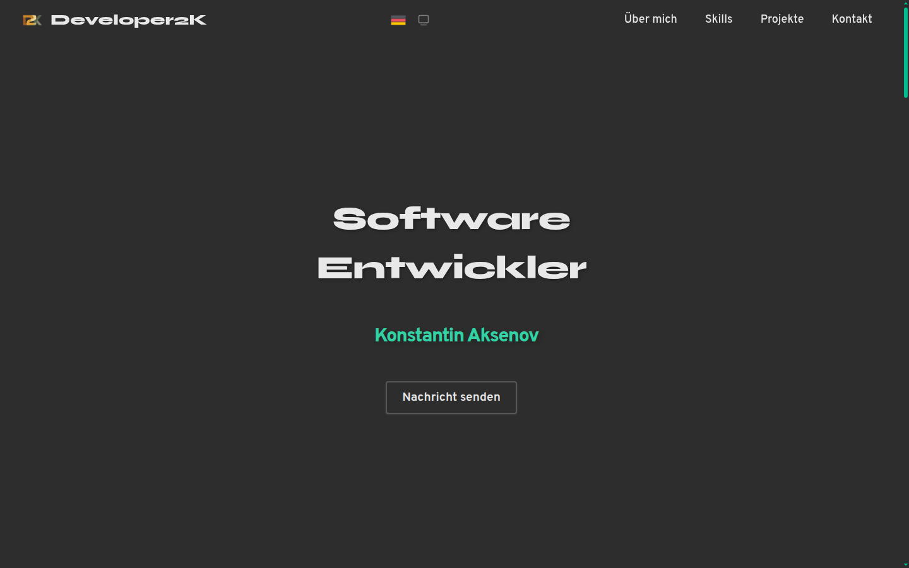

# Portfolio — Angular SPA

Persönliche Portfolio-Website von Konstantin Aksenov, Dev2K Software.

## Goal

Die Seite zeigt Fähigkeiten, Projekte und Werdegang für Recruiter und potenzielle
Auftraggeber — als Single-Page-Application, mobile-first, zweisprachig (DE/EN).

Primäre Domain: `https://portfolio.dev2ksoftware.com`

## Preview



## Tech Stack

| Layer     | Technology                                                |
| --------- | --------------------------------------------------------- |
| Framework | Angular 21 SPA, standalone components, signals, zoneless  |
| Styling   | SCSS                                                      |
| i18n      | Lokale JSON-Übersetzungen in `public/i18n/`               |
| PWA       | Angular Service Worker mit Hell-/Dunkel-Manifest          |
| Testing   | Jasmine + Karma über den Angular-Test-Builder             |
| Backend   | PHP-FPM (Kontaktformular), eigener Container              |
| CI/CD     | GitHub Actions                                            |
| Hosting   | Self-hosted auf Unraid über Cloudflare Tunnel und NPMplus |
| Domain    | `portfolio.dev2ksoftware.com`                             |

## Sections

| Section  | Purpose                                     |
| -------- | ------------------------------------------- |
| Hero     | Name, Rolle, Kontakt-CTA                    |
| About    | Kurzvorstellung, Dev2K Software, Tech-Stack |
| Skills   | Technologie-Icons nach Kategorie            |
| Projects | Projektkarten mit Live-Demo-Links           |
| Contact  | Kontaktformular + Direkt-Mail               |
| Legal    | Impressum, Datenschutz, Quellenangaben      |

## Development

```bash
cd portfolio
npm ci
npm start
```

App läuft dann auf `http://localhost:4200`.

## Checks

```bash
npm run test:ci        # Headless-Tests mit Coverage
npm run build           # Produktions-Build
npm run docs             # TypeDoc-API-Dokumentation
npm run deploy:prepare  # Build + Tests + Doku nacheinander
```

`npm run test:ci` erwartet Chromium unter `/usr/bin/chromium-browser`.

## Git-Flow

`main → staging → dev → feature/*`, GitHub-Ruleset auf allen drei Hauptbranches
(PR-Pflicht, kein Force-Push). Dependency-Updates laufen über Renovate
(`renovate.json`) — Patch/Pin/Digest automatisch, Minor/Major und `@angular/*`
warten auf Freigabe.

## Deployment Target

```text
GitHub Actions (main / staging Push)
  -> cloudflared access ssh (Cloudflare Access, Service Token)
  -> Tunnel `unraid-tower`
  -> sshd auf dem Tower-Host, erzwungenes rsync-Skript
  -> /mnt/nvme/appdata/static-sites/www/portfolio(-staging)/
  -> static-sites nginx-Container
       -> statische Dateien direkt
       -> /api/contact/contact.php per fastcgi_pass -> portfolio-php (PHP-FPM)
```

Volle Architektur-Doku: [`docs/manual/`](./docs/manual/) und
`dev2k-wiki/projekte/portfolio-architektur.md`.

## Developer

Konstantin Aksenov
Dev2K Software
